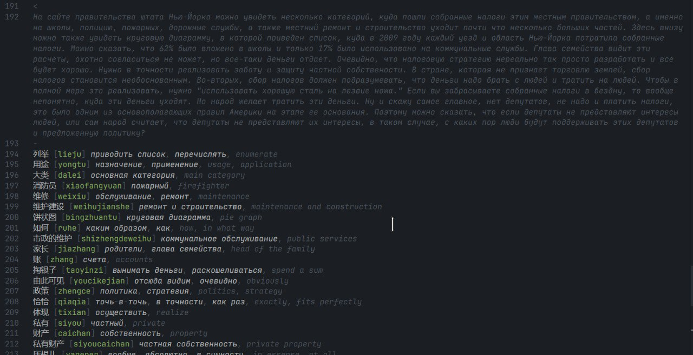
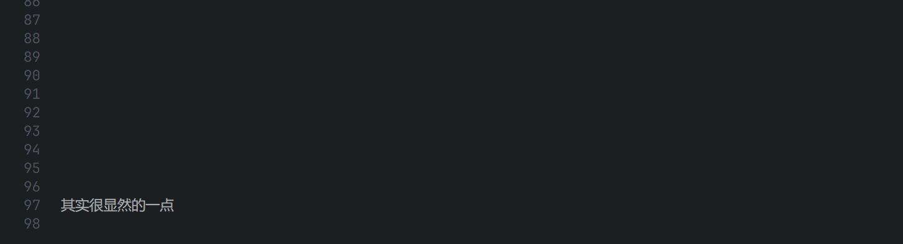

# Chinese Roofs

Расширение для VSCode. Формат файла - `.chr`. Для личного пользования.

## Демонстрация

Одно слово:


Переведенный текст и словарь:



Подсказки от БКРС:



## Дополнительная конфигурация темы

```json
{
  {
    "scope": ["translation.text.chr"],
    "settings": {/* ... */}
  },
  {
    "scope": ["translation.vocabulary.word.original.chr"],
    "settings": {/* ... */}
  },
  {
    "scope": ["translation.vocabulary.word.pinyin.chr"],
    "settings": {/* ... */}
  },
  {
    "scope": "translation.vocabulary.word.pinyin.char.chr",
    "settings": {/* ... */}
  },
  {
    "scope": "translation.vocabulary.word.pinyin.tone.chr",
    "settings": {/* ... */}
  },
  {
    "scope": "translation.vocabulary.word.translation.chr",
    "settings": {/* ... */}
  }
}
```
